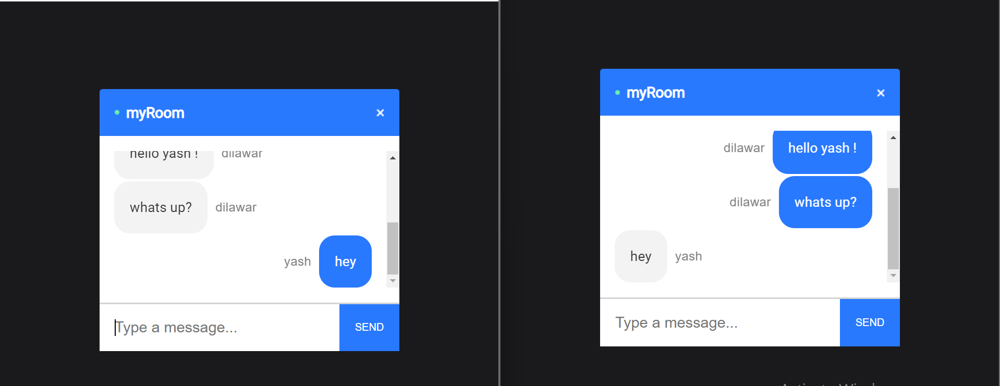

# Realtime Chat Application



## Introduction
This is a code repository for the chat application using socket.io. 

It is a full Realtime Chat Application build using React on the front end, with NodeJS + Socket.io web socket library on the back end. 


Setup:
- run ```npm i && npm start``` for both client and server side to start the development server
